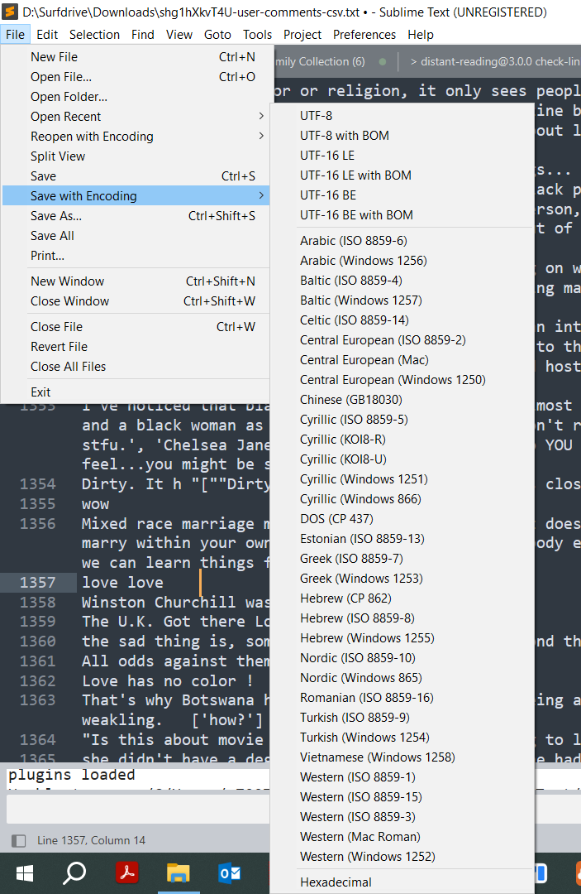
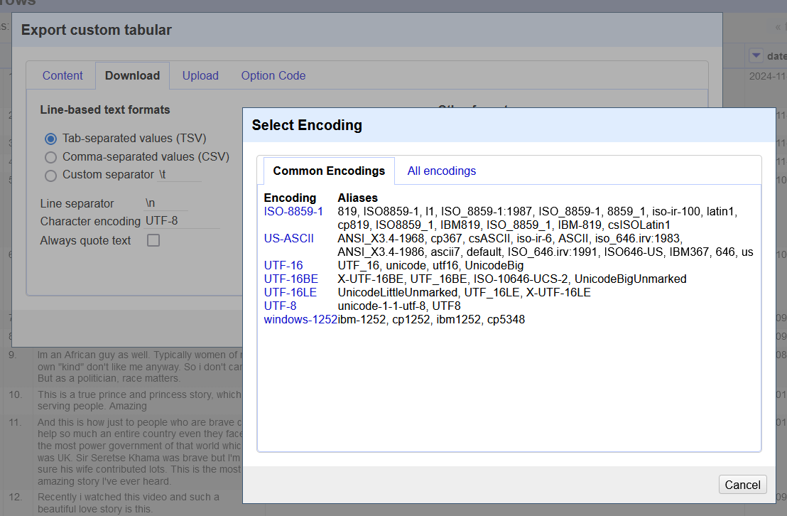

# Advice for data cleaning

## Why data cleaning can be necessary in computational text analysis

Text data that comes from digital sources such as websites and social media platforms can pose several challenges for text analysis, 
especially when third-party tools such as [Voyant](https://voyant-tools.org/) are used. One challenge is the frequent use of emojis and weblinks in digital communication.
They can distract from the text content you wish to analyse, and many emojis don't resolve properly in Voyant Tools. 
Special characters and certain punctuation marks can also appear distorted, e.g. when originally typed on Asian computers. 
To avoid a messy "character salad" during your data analysis, you have two options:

a) You can decide to remove emojis, links, and punctuation marks before ingesting the text data into your analysis tool. Check the sections below for further details.

b) You can try to encode the entire file differently. Voyant Tools is designed to handle [UTF-8 encoding](https://www.w3schools.com/charsets/ref_html_utf8.asp) by default, as this is the most widely-used and robust standard for multilingual text processing. However, if special characters interfere with the parsing, you can also try one of the following encodings:

- ISO-8859-1 (Latin-1):
This is a simpler encoding for Western European languages and excludes emojis or certain symbols. It’s less robust than UTF-8 but might be useful for plain text without too many special characters.

- ASCII:
A basic encoding that only supports standard Latin characters. It will strip non-standard characters and emojis but may fail if your corpus includes accented characters (e.g., é, ñ, ü), so it is less useful for languages such as French, Spanish or German.

To change the encoding of a plain text file, you can open it in a powerful text editor such as [Sublime](https://www.sublimetext.com/), which has a "Save with Encoding" option and allows you to select from a wide range of ISO encodings (see screenshot). 

**Figure 1.** Changing file encoding in Sublime Text using the *Save with Encoding* menu.

If you are working with Open Refine, you can also adjust the encoding there before saving the file to *.txt*. In Open Refine, the standard encoding also is UTF-8, but ASCII and Latin-1 are also available (see screenshot).

**Figure 2.** Changing file encoding in OpenRefine when exporting a dataset.

## Semi-manual data cleaning

Up to a range of about 50000 social media posts, data can still be cleaned semi-manually in EXCEL, Open Refine or a browser-based cleaning tool. 

- EXCEL and similar software have many in-built cleaning functionalities that you may want to explore. You can, for instance, use the *Remove Duplicates* feature (found under the Data tab) to delete any duplicate entries. You can use functions like UPPER(), LOWER(), or PROPER() to standardise text formats. Similarly, EXCEL has a TRIM() function to remove extra spaces before or after text entries. EXCEL also permits filtering and conditional formatting to highlight special features. Last but not least, EXCEL can be used to create simple charts (such as bar graphs) to visualise data. Check out the Microsoft documentation for more information or find some tutorial videos on YouTube.
  
- [Text cleaner](https://textcleaner.net/?utm_content=cmp-true) is a browser-based, all-in-one text cleaning and text formatting online tool that can perform many simple and complex text operations including format text, clean text, remove line breaks, strip HTML, convert case, and find and replace text online. You can copy and paste text to the input box on the website and select the cleaning operations.
  
- [OpenRefine](https://openrefine.org/), which you can directly run on the UM DSRI, is a powerful free, open source tool for working with messy data in spreadsheets. Open Refines helps you clean data but also has options for exporting them into new formats. Please check out the [Skills 1.3 Open Refine](https://monikabarget.github.io/distant-reading/pages_skills1_3_OpenRefine.html) page for more details!

## Cleaning (larger) data sets with scripts

Large data sets can cause severe performance issues when opened in tools like EXCEL, so cleaning via script is recommended. The following script permits the cleaning of all kinds of social media collected in .txt format, with a special focus on deleting @ signs, hashtags, URLs and emojis:

- [Clean data with Python](https://github.com/MonikaBarget/distant-reading/tree/main/python/Clean_data.py)

### Cited works and recommendations for further reading

- Maloney, K. (2021, September 27). Subject guides: Text and data mining: 4. Cleaning and preparing data. https://libguides.library.usyd.edu.au/text_data_mining/cleaning
- Metaweb Technologies, Inc. (2012). OpenRefine. https://openrefine.org/
- Rinker, T. (2020). Textstem [R]. https://github.com/trinker/textstem (Original work published 2017)
- Text Cleaner: Text Cleaning and Text Formatting Online. (n.d.). Text Cleaner. Retrieved October 13, 2021, from https://textcleaner.net/
- Text Cleanser app (no longer under active development). (n.d.). Retrieved October 13, 2021, from https://apps.nozavi.com/apps/others/older-apps.html
- TextCleanr—Text Cleaner Tool. (n.d.). Retrieved October 13, 2021, from https://www.textcleanr.com/
- Trifacta Wrangler. (n.d.). Retrieved October 14, 2021, from https://cloud.trifacta.com/sign-in

