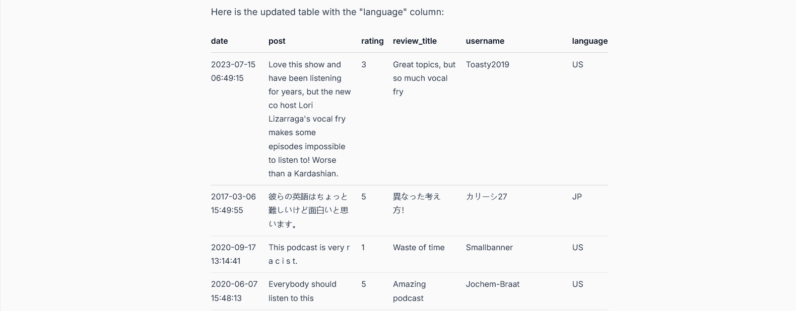

# Processing multiple languages

## Examples of multilingual humanities and social sciences data

Working with multilingual data is very common in the humanities and social sciences. Academic and legal texts from different time periods can be written in more than one language or contain foreign technical terms within one dominant language. Private correspondence can also be multilingual when the writers include phrases in a minority language (such as Irish or Welsh) into texts written in the majority language (e.g., English). Social media data, too, are often not confined to a single language. Comments under a YouTube video, for example, can be written in people's native languages even when the video itself was published in English, and scraping social media posts by hashtag will also give you diverse datasets as topics trend across national and linguistic boundaries.

## How to handle multilingual datasets in computational text analysis

There are different ways to handle multilingual data, and it is important that you provide a clear academic justification for your chosen approach. In some cases, you may have good reasons to filter your data by language before starting the analysis. In other cases, it can be relevant to your research question to analyse texts in different languages separately and compare the results. However, it can also be a useful approach not to separate the dataset by language at all, but all to consciously integrate different expressions in the overall analysis. This is most often the case when one language is very prominent in the data. Together with Susan Schreibman, I followed the latter approach when analysing women's correspondence from the Irish Letters 1916-1923 collection. This historical collection of correspondence was mostly written in English, but some people identifying with Irish nationalism also used greetings or keywords in Irish. Similarly, some correspondence contained French and German words due to World War I or aristocratic families' educational interest in foreign languages. In our book chapter My recent [Feminist DH: A Historical Perspective](https://muse.jhu.edu/pub/34/oa_edited_volume/chapter/4144235), Susan Schreibman and I have outlined how we treated the non-English writing as separate themes in our corpus. We used topic modelling algorithms in Python to make sense of our data. Topic modelling is also possible in Voyant Tools.

## Working with multiple languages in Voyant

When you decide that individual words in a non-dominant language distort your data analysis and are not necessary for answering your research question, you can remove those words by adding them to the stopword list in Voyant Tools. Most foreign words in an English-dominated data set will not be very frequent and may thus not even appear in the top-100 most frequent words, so you may also want to keep them and perhaps check their context when they are important for the social identities of people that use them or when they introduce a particular discourse to your dataset. When a data set is rather equally divided between languages and you would like to analyse them separately, filtering the data in Open Refine first is highly recommended. Data collected via an official social media API often come with a country code per post that can help you with this process, but there can also be cases where you may need to create your own `language` column. You can then either manually go through the data and assign a language code such as `en` for English there, are use AI to help you with the process. When using AI, it is important to fully anonymise the data first so that no sensitive information is stored on a third-party could and / or used for model training.

## Recent developments in multilingual NLP

Israel Fianyi and Soonja Yeom (2024) from the University of Tasmania, Australia, are among researchers who explore new strategies for "extracting valuable insights from diverse linguistic datasets using the baseline technique (language-gnostic and Language-specific models). (p. 51)

P. 52 describes their model architecture:

<blockquote>We tokenize the input text using language-specific tokenizers (NLTK
Tokenizer, spaCy Tokenizer, StandfordNLP Tokenizer and TokTokTokenizer) to obtain word as well as subword embeddings. Furthermore, the study uses a shared embedding layer to map input tokens into dense vector representations, making the model capture shared linguistic features across languages. We used word2vec, GloVe and FastText to pretrain the word
embedding to initialize word representations [22-24]. The study explores all three (3) pretraining algorithms, each with unique features and challenges critical to our experiment.</blockquote>

P. 53:

<blockquote>The pretrained model's fine-tuning on the target language data enables it to adapt to the target language's linguistic characteristics while leveraging the knowledge learned from the source language. This approach allows for efficient utilization of pre-existing
resources and improves the model's performance in the target language task.
Furthermore, we evaluate the fine-tined model with parameters θt on target language tasks and event extraction, using the appropriate evaluation metrics. (...) The study compared the performance of our Smart Framework Model against the baseline models. While evaluating the models against precision, recall, F1-Score, and accuracy for both approaches. The shared-parameter and cross-lingual transfer learning models significantly outperform the language-agnostic model across all evaluation metrics. For instance, multilingual models achieve about 14% higher accuracy than language-agnostic models. While the language-specific models perform relatively better than the language-agnostic model, they still fall short of the performance achieved by the multilingual models.</blockquote>

P. 55:

<blockquote>In conclusion, the experiments conducted on the Smart Framework for Multilingual Information Extraction in NLP have demonstrated its remarkable effectiveness and versatility across diverse linguistic contexts. Through rigorous evaluation and comparison with baseline models, the Smart Framework consistently outperformed in various aspects, including precision, recall, and cross-lingual generalization for event extraction tasks. Notably, its ability to extract more words across multiple languages signifies enhanced coverage and adaptability. Furthermore, user feedback and
acceptance reaffirmed its practical utility and user satisfaction. These results underscore the significance of the Smart Framework as a valuable tool for extracting actionable insights from
multilingual data sources, with implications spanning information retrieval, sentiment analysis, and beyond. As such, the Smart Framework is poised to contribute substantially to advancing
multilingual NLP and its myriad applications in real-world scenarios.</blockquote>

Transformer-based optimisation of text detection and text extraction is also being tested... EXAMPLES!

Sarah Thompson (2023) discusses how advanced machines learning (deep learning) has revolutionised working mutilingual NLP but also points out that challenges remain, especially when models for less frequently used languages cannot be trained on sufficiently large data sets:

<blockquote>With globalization fostering communication across diverse languages, the necessity for sophisticated NLP tools has never been more critical. This study emphasizes how deep learning techniques, including recurrent neural networks (RNNs), convolutional neural networks (CNNs), and transformer models, are revolutionizing text understanding and translation processes. By employing large datasets and advanced algorithms, deep learning has significantly improved machine translation quality, sentiment analysis, and contextual understanding. Furthermore, this paper discusses the challenges faced in multilingual NLP, such as data scarcity for underrepresented languages and cultural nuances, and presents potential solutions leveraging deep learning methodologies.</blockquote>

## Language-coding with AI

To give you an example of how LLMs can be used to language-code your data, I am sharing the prompt that I gave to [Mistral AI](https://mistral.ai/) to add language information to a small sample CSV file:

<blockquote>I am giving you a test CSV file with social media posts. Your task is to expand the table with a "language" column and add a country code for the language in which each post is written.</blockquote>

Below the prompt, I pasted in several tables rows from a social media file containing text both in English and in Japanese. The result I received was the following:

<blockquote>I understand your task. You want to add a "language" column to the table and identify the language of each post using the country code. Let's start by processing the data to add the new column and then determine the language for each post. It seems that the `langdetect` library is not available in this environment. However, I can manually identify the languages and map them to country codes based on the content of the posts. Let's proceed with that approach. Here is the updated table with the "language" column: (...)</blockquote>

As you can see in the screenshot, Mistral's AI chatbot <em>Le Chat</em> was able to correctly identify the post language. It was then possible for me to copy the data from the new column into my existing CSV file and proceed with data filtering in Open Refine. As AI tools tend to hallucinate and change text, e.g. when they hit the output rate limit, you absolutely have to double-check the results, however, and I would not recommend letting AI re-create the entire file for you as it can also manipulate the original posts without you noticing.

## Script-based approaches to recognising and filtering languages

Of course, it is also possible to automate language assignment with programming languages like R and Python. In Python, you can use the [`langdetect` package](https://pypi.org/project/langdetect/) as part of a script that iterates through each content cell in a data table. Another Python package for short texts and mixed-language texts is [`lingua-py`](https://github.com/pemistahl/lingua-py). For <em>Medium</em>, Simeon Grancharov (2023) has [compared the functionalities of `langdetect` and `langid`](https://medium.com/@monigrancharov/text-language-detection-with-python-beb49d9667b3):

<blockquote>Since we are based on accuracy, I would say that the Landetect algorithm performs slightly better than the Langid one.</blockquote>

However, Grancharov also notes that both algorithms which he tested made mistakes. In one example, he analysed two lines of Spanish text but "each algorithm predicted Spanish in only one of the cases", also naming French and Italian as likely languages. Such mistakes are, of course, more likely when languages are very similar to each other and share some vocabulary as well as certain grammatical features. This is why automated language detection always requires human controls, even when the algorithm comes from a trusted source and was explicitly developed for academic research.

### Sources cited and recommendations for further reading

Barget, M., & Schreibman, S. (2025). Feminist DH: A Historical Perspective. In: Feminist Digital Humanities: Intersections in Practice, ed. by L. M. Rhody & S. Schreibman. Champaign: University of Illinois Press, pp. 35-58. [https://muse.jhu.edu/book/132502]([https://muse.jhu.edu/book/132502]).

Grancharov, S. (2023, May 29). Text language detection with python. Medium. [https://medium.com/@monigrancharov/text-language-detection-with-python-beb49d9667b3](https://medium.com/@monigrancharov/text-language-detection-with-python-beb49d9667b3)

Nguyen, M. V., Lai, V. D., Veyseh, A. P. B., & Nguyen, T. H. (2021). Trankit: A light-weight transformer-based toolkit for multilingual natural language processing (No. arXiv:2101.03289). arXiv. [https://doi.org/10.48550/arXiv.2101.03289](https://doi.org/10.48550/arXiv.2101.03289)

Thompson, S. (2023). Deep learning for natural language processing: Enhancing text understanding in multilingual systems. Journal of Artificial Intelligence Research, 3(2), 180–186. [https://thesciencebrigade.com/JAIR/article/view/404](https://thesciencebrigade.com/JAIR/article/view/404)

Yeom, S., & Fianyi, I. (2024). A Smart Framework for Multilingual Information Extraction (Version 1). 2024 International Conference on Convergent and Smart Systems (ICCSS 2024), Pioneer International University, Nairobi, Kenya, proceeding published by the University of Tasmania. [https://hdl.handle.net/102.100.100/661242](https://hdl.handle.net/102.100.100/661242)

