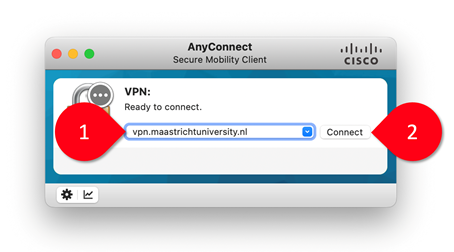
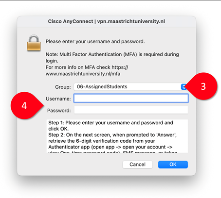
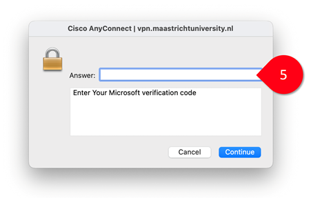

# **Getting started with UM VPN**

## Download and install the client

On MacOS and Windows: download and install the Maastricht University VPN client from [vpn.maastrichtuniversity.nl](http://vpn.maastrichtuniversity.nl).

**Figure 1.** Using the Cisco AnyConnect client to connect to vpn.maastrichtuniversity.nl.

## Launch the UM VPN client

- Open the *Cisco AnyConnect Secure Mobility Client*.
- Specify the server `vpn.maastrichtuniversity.nl` (1) and click *Connect* (2).
- Select the group *06-AssignedStudents* (3), enter your username (I-number) and password (4), and press *OK*.

**Figure 2.** Entering your UM username and password in the Cisco AnyConnect client.

- Enter your one-time passcode (5).

**Figure 3.** Entering your verification code in the Cisco AnyConnect client.

🙌 These instructions were provided by Arnoud Wils (The Plant, FASoS). 
