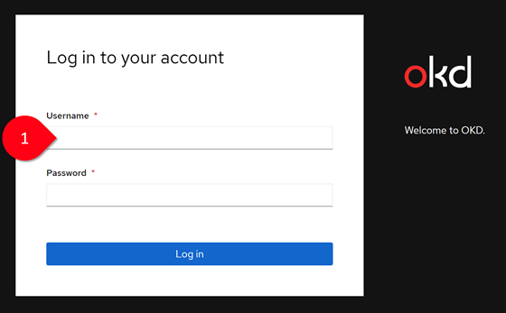
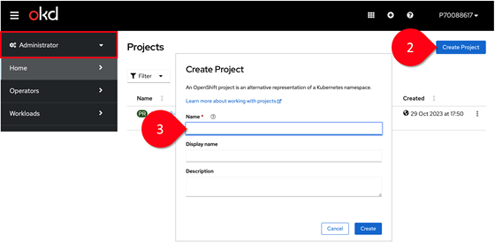
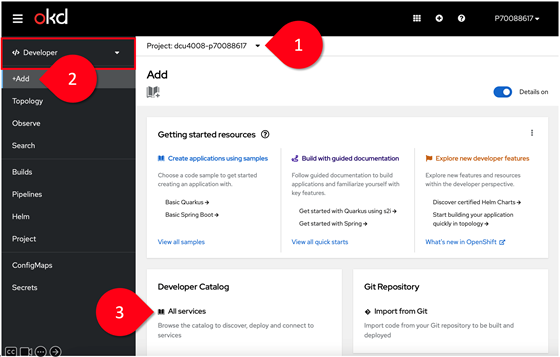
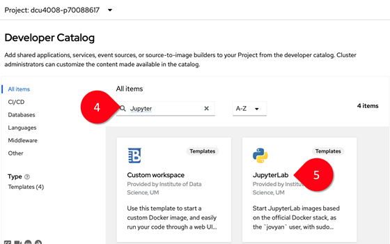
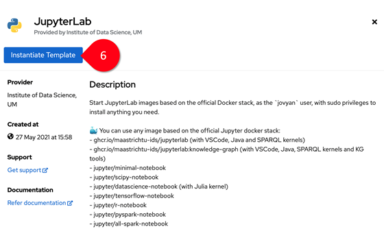
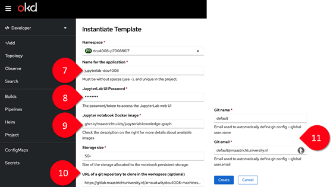

# Getting started with the DSRI (DCU4008)

## Step 1 - Log in to DSRI

You must be connected to the UM network to access the DSRI.

- Connect to the UM VPN Maastricht University [VPN client](http://vpn.maastrichtuniversity.nl).
- Access the DSRI web UI at [https://console-openshift-console.apps.dsri2.unimaas.nl](https://console-openshift-console.apps.dsri2.unimaas.nl).
- Your username (1) will always be your student ID at Maastricht University (a.k.a. your I-number), e.g. I6000000.
- Use your general UM password.

## Step 2 - Create a project

- Select the *Administrator* perspective from the DSRI Dashboard menu, and click *Create Project* (2).
- In the Create Project dialogue box, enter a unique name in the Name field (3). Use a short and meaningful name for your project as the project identifier is unique across all projects. A good practice is: `<project name>-<your student I-number>`.
- Optionally add a *Display Name* and a *Description* for the project.
- Click *Create*.

## Step 3 - Instantiate the Jupyter Notebook image

- Select the *Developer* perspective from the DSRI Dashboard menu, and make sure that your project is selected in the drop-down list (1).
- Click on *Add* (2) and select *All services* from the *Developer Catalog* (3).
- Search for "Jupyter" (4) and select the JupyterLab template (5).
- Click on *Instantiate Template* (6).

When instantiating the template, you will need to provide some parameters, such as:

- Name of the application: `<course-id>-<application-name>` (7).
- Choose a password to access the notebook with the script you are going to run (8).
- Specify the Docker image to use for the notebook: `ghcr.io/maastrichtu-ids/jupyterlab:knowledge-graph` (9).
- URL of Git repository: `https://gitlab.maastrichtuniversity.nl/the-plant/dcu4008-machines-of-knowledge.git` (10).
- Enter your username as *Git name* and your UM email as *Git email* (11).
- Click on *Create*. It will take a few seconds (up to 1 minute) to get your notebook environment up and running.

## Step 4 - Launch the Jupyter Notebook environment

- Select *Topology* in the left bar menu, and click on the name of your application (Step 3) (12).
- The link under the heading *Routes* on the right side will launch the JupyterLab environment in your web browser (13).

## Step 5 - Run your script

- On the left is the File Explorer. The folder *persistent* (14) is your personal space on the DSRI for this project. In the folder *notebooks* (15) you will find the Apple Web Scraper script that we will be using in this course. Double-click on the file to open the Jupyter notebook where you can run the script. You can upload and download files from the File Explorer.
- In the main *Launcher* window, you can launch *OpenRefine* (16), a web-based tool for exploring, analyzing, and cleaning up your data. (If you accidentally close the Launcher window, you can easily reopen another one from the top menu *File > New Launcher*).

**IMPORTANT: Always download your datasets to your local machine and make sure to have backups!**
