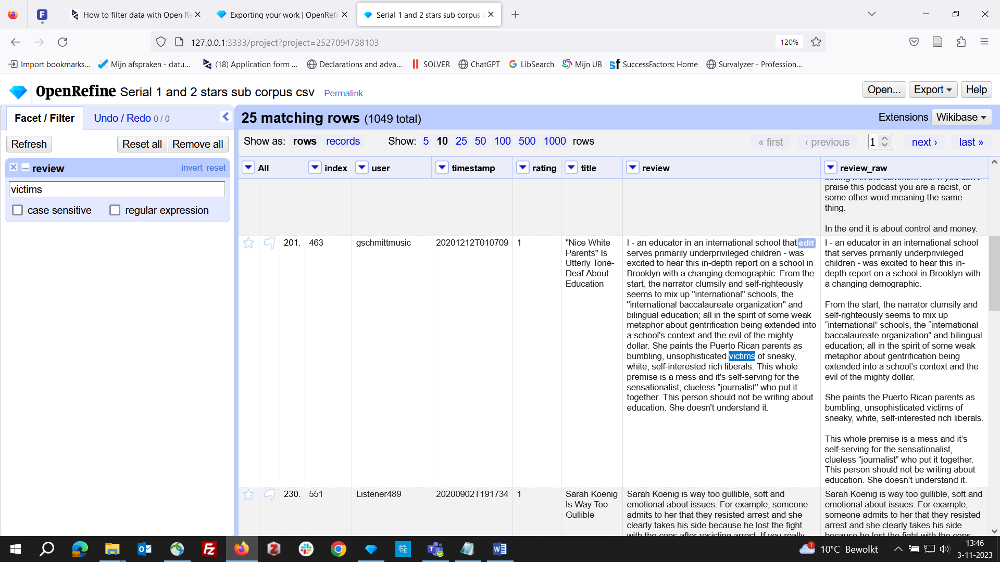
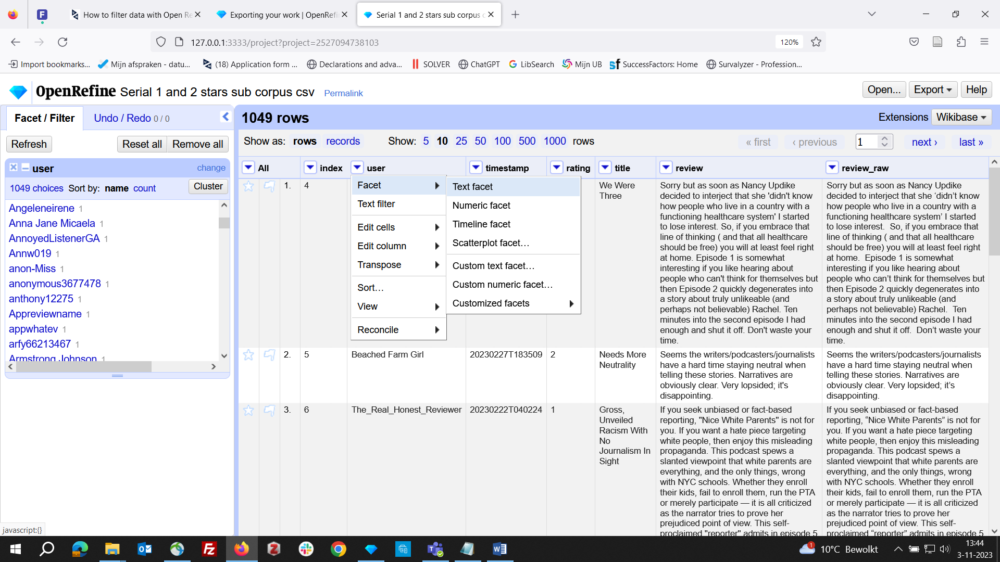
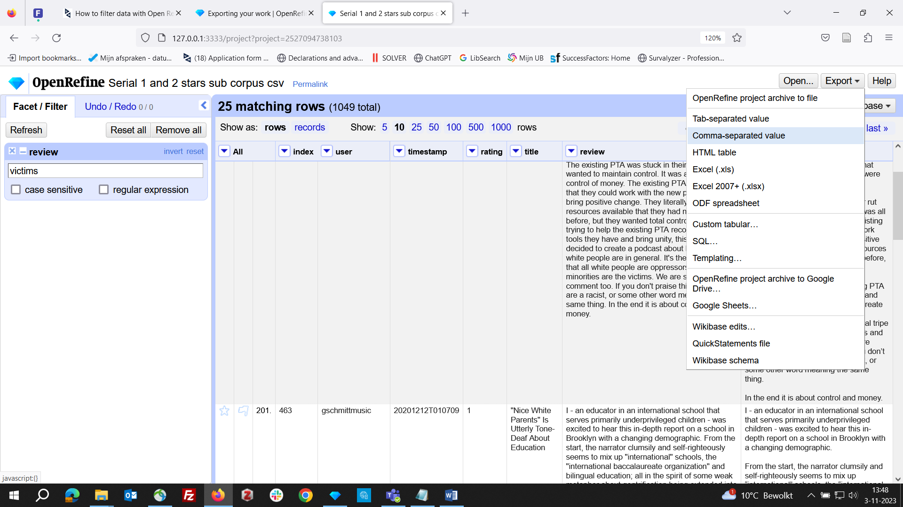
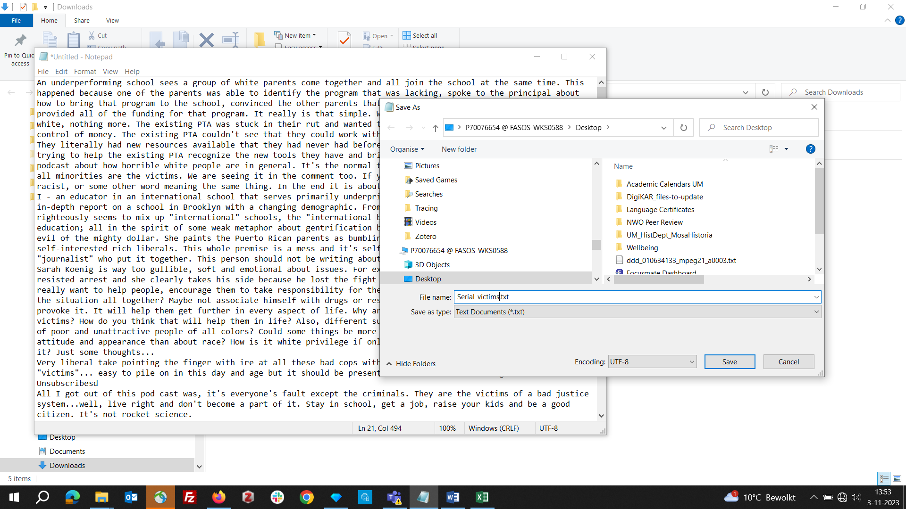

# Open Refine for cleaning spreadsheet data

Open Refine is a powerful tool for the manipulation of data in table format. You can use Open Refine directly in the UM DSRI or install it on your local machines.  
In our course, Open Refine helps us filter podcast reviews to create sub-collections of data for analysis in Voyant Tools.

## Using filters in Open Refine

You can filter the data displayed in OpenRefine by applying a ‘Text Filter’, which looks for a particular piece of text appearing in a column. Text filters are applied by clicking the drop-down menu at the top of the column you want to apply the filter to and choosing **Text filter**. The filter options appear in the left-hand panel. Simply type in the text you want to use in the Filter to display only rows which contain that text in the relevant column. You can also use [regular expressions](https://librarycarpentry.github.io/lc-data-intro/04-regular-expressions) in the filter. 

It is very important to note that when you have filtered the data displayed in OpenRefine, any operations you carry out will apply only to the rows that match the filter – that is, the data currently being displayed. This also means that only the current selection will be saved when you export your data while a filter is active!

**Screenshot 1**: applying a text filter to the reviews column to find all reviews mentioning "victims"  

## Working with facets in Open Refine

Facets are one of the most useful features of OpenRefine and can help both get an overview of the data in a project as well as helping you bring more consistency to the data. A ‘Facet’ groups all the values that appear in a column, and then allows you to filter the data by these values and edit values across many records at the same time. The simplest type of Facet is called a ‘Text facet’. This simply groups all the text values in a column and lists each value with the number of records it appears in. The facet information always appears in the left-hand panel in the OpenRefine interface.

To create a Text Facet for a column, click on the drop-down menu at the top of the publisher column and choose `Facet -> Text Facet`. The facet will then appear in the left-hand panel. The facet consists of a list of values used in the data. You can filter the data displayed by clicking on one of these headings. You can include multiple values from the facet in a filter at one time by using the `Include` option, which appears when you put your mouse over a value in the Facet. You can also `invert` the filter to show all records which do not match your selected values. This option appears at the top of the Facet panel when you select a value from the facet to apply as a filter.

Facets can be a great way to select podcast reviews by user names, time periods, or star ratings.

**Screenshot 2**: facet applied to "user" column, showing all user names and the number of reviews written  

Please also read the documentation for "Exporting your Work" in the official [Open Refine](https://openrefine.org/docs/manual/exporting) documentation!

**Screenshot 3**: using the "export" option to save a data selection in a new file  

**Screenshot 4**: raw text from "reviews" column copied into a .txt file  

The following YouTube video by Monika explains the process of filtering data in Open Refine and exporting them step-by-step:

The focus is on using a general text filter to find keywords and using the facet filter to explore rankings. However, OpenRefine has many other
exciting functionalities not covered in this brief introduction! If you want to learn more, check out other videos shared by researchers and librarians on YouTube. One [Open Refine tutorial provided by researchers from Edinburgh](https://www.youtube.com/watch?v=wfS1qTKFQoI) does not only explain editing spreadsheets but also covers uploading data easily to Wikidata, which may be of interest to you in the future.
