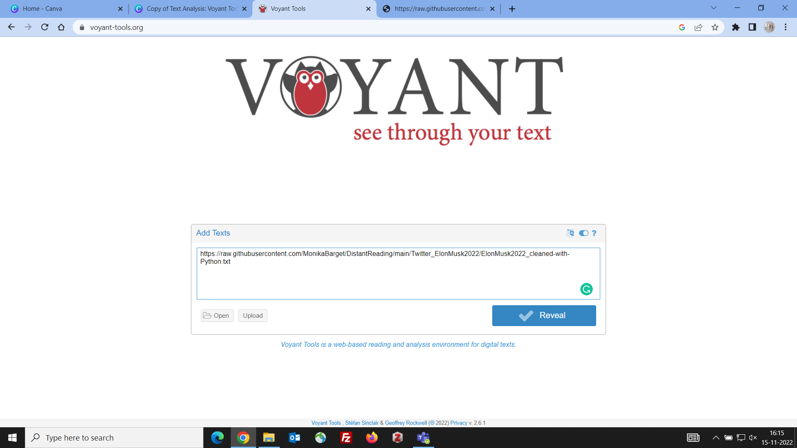
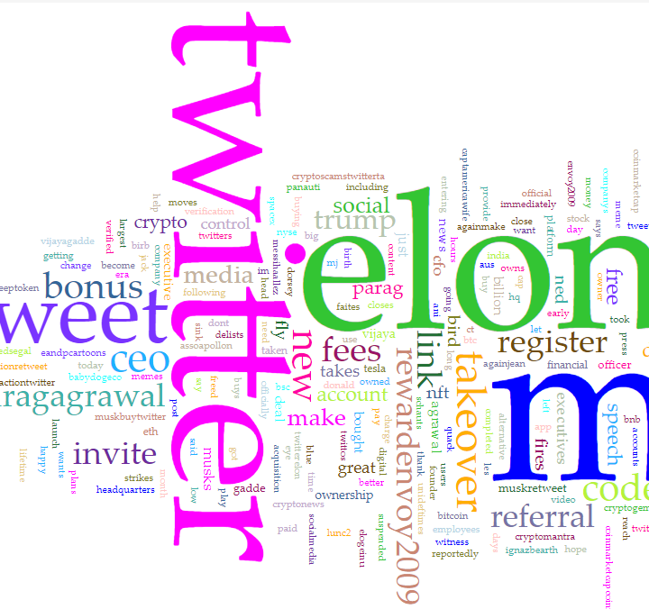
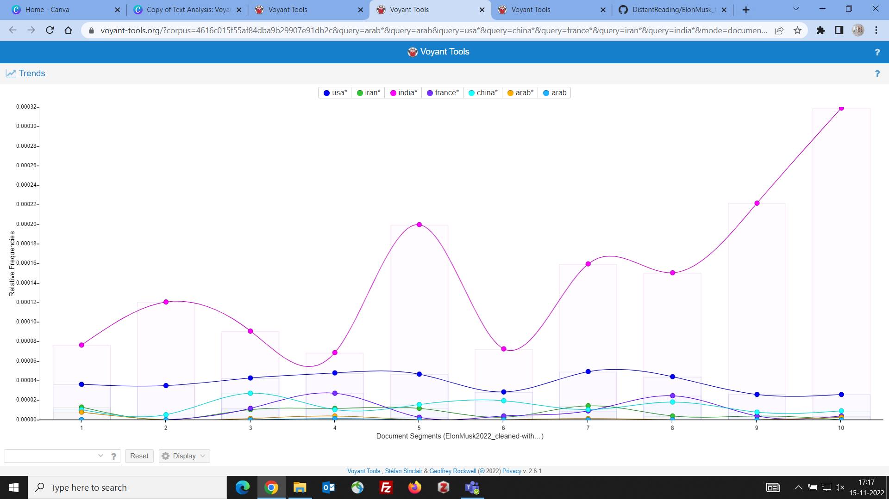
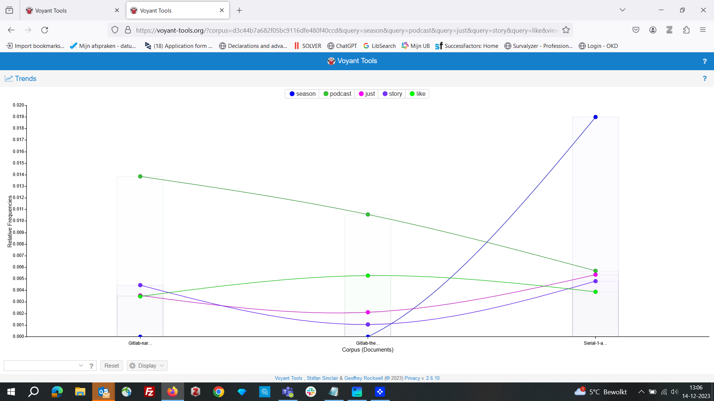
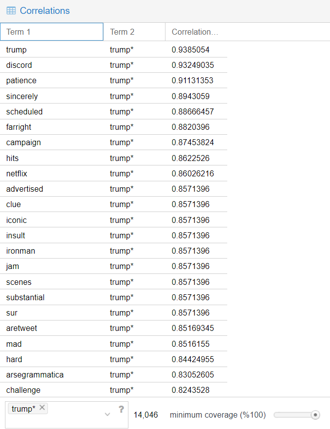
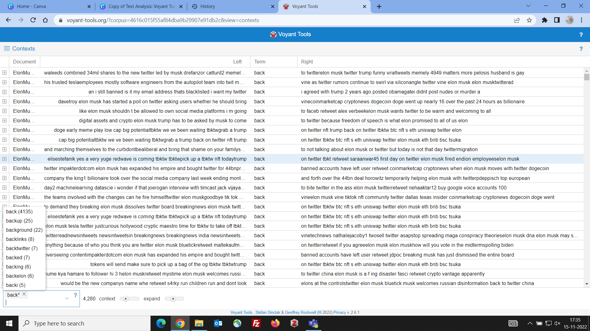

# An introduction to Voyant Tools

## Why text analysis with Voyant Tools

Voyant Tools is a web-based text analysis and visualization platform that is popular in the humanities and social sciences. Voyant Tools is user-friendly and freely available online. It can be used by researchers without any technical expertise. The platform offers a variety of data visualisations, such as word clouds, word frequency charts, and dispersion plots, which can help users identify patterns, trends, and anomalies in a text corpus. Visualisations can make it easier to engage with and interpret large amounts of textual data (that may be impossible to read in a reasonable amount of time). Researchers can adjust parameters, apply filters, and experiment with various visualizations to uncover new perspectives. This process of computational text analysis is also called *distant reading* (as opposed to traditional *close reading*).

## Ingest your data into Voyant Tools

Go to the [Voyant Tools](https://voyant-tools.org/) website and simply paste your raw text or the URL of raw text data (as stored in Github) into the "add text" field. If you have data in .txt format (individual file) or several files in a .zip archive, you can use the upload option to ingest the files. Press the blue "reveal" button and start exploring the data set!

## Steps of text analysis in Voyant

The following four steps describe an exemplary text analysis in Voyant and can serve as a guideline for your own work. The idea is to progress from more high-level observations to a more detailed and comparative analysis of your data set(s).

**Step 1: Word Cloud and Frequencies Table Analysis**

- Start by examining the [word cloud](https://voyant-tools.org/docs/tutorial-cirrus.html) (or Cirrus) and the corresponding frequencies table in Voyant Tools (Voyant Official Website, 2018).
- Identify the most prominent words in the data.
- Consider what topics or themes you can discern from the words presented.
- Look for mentions of "protagonists" in the data. Are any people or institutions mentioned by name, and why are they important?
- Take note of any places (e.g., cities and countries) mentioned in the data and consider why they might be included.
- Reflect on any surprising findings or information that is challenging to contextualise.

**Step 2: Comparative Analysis with the "Trends" Tool**

- [Trends](https://voyant-tools.org/docs/tutorial-trends.html) shows a line graph depicting the distribution of a word’s occurrence across a corpus or document (Voyant Official Website, 2018).
- Note down words that express emotions or people's opinions about a podcast and its hosts. Use the "Trends" tool to analyse how these emotions or opinions have evolved over time.
- Of course, the "Trends" tool can also help you track the prominence of people, countries, or activities in your data set.
- Make sure to know what time frame your data set covers. In data sets collected from the web, the timeline is often reversed, so the newest data are shown first. This means that you may need to read your graph from right to left unless you carefully sort your data by time first (e.g. using Open Refine). In a narrative text such as a novel, the trend graph simply reflects the story line across the different chapters.
- Explore groups of words for comparative analysis within the "Trends" tool. Ensure that the word groups are homogeneous, such as looking at different place names or tracking trends for specific adjectives like "good," "bad," "exciting," or "boring." Avoid combining terms from different word groups.

If you have more than one text, you will see that the trends graph show each text in your corpus as one column by default, allowing you to compare the frequencies of words in the different texts. You can also change the description of the y-axis to either show relative frequencies (meaning a fraction of 1) or absolute numbers.

**Step 3: Co-Occurrences and Correlations**

- In text analysis, *co-occurrence* refers to the frequency with which two words or terms appear together within a specific context, such as a sentence, paragraph, or document. It is a measure of how often two words occur in a defined window of words. Co-occurrence is typically based on simple statistical counts. *Collocation* is a subset of co-occurrence and identifies commonly used word pairs. Interesting collocations can be combinations of adjectives and nouns (e.g. "wrong information"), or of nouns and verbs (e.g. "politicians lie"). In Voyant, both the [TermsBerry](https://voyant-tools.org/docs/tutorial-termsberry.html) tool and the [Collocates Graph](https://voyant-tools.org/docs/tutorial-collocatesgraph.html) provide a way of exploring high frequency terms and their collocates (words that occur in close proximity) (Voyant Official Website, 2018).
- Correlation, in NLP, refers to a more advanced statistical measure that assesses the strength and direction of the relationship between two words or terms in a text corpus. It quantifies how closely the presence or absence of one term is related to the presence or absence of another term across a larger set of documents. For the calculation of correlations, Pearson's correlation coefficient or pointwise mutual information (PMI) are used.
- In Voyant, the [Correlations](https://voyant-tools.org/docs/tutorial-correlations.html) tool (see screenshot below) enables an exploration of the extent to which term frequencies vary in sync, meaning terms whose frequencies rise and fall together or inversely. The correlation coefficient is calculated by comparing the relative frequencies of terms. A coefficient that approaches 1 indicates that values correlate positively, they rise and fall together. A coefficient that approaches -1 indicates that values correlate negatively, frequencies rise for one term as it drops for the other. Coefficients that approach 0 indicate little correlation, positive or negative (Voyant Official Website, 2018).
- Use the "correlations" tool or the "terms berry" and investigate words that are commonly associated with key terms that you found in the word cloud. Analyse what the correlations imply about the podcast reviewers' opinions.
- Experiment with several important keywords and carefully interpret the results. Consider how they shed light on the podcast's content and potential broader debates in a specific country or even worldwide.

**Step 4: Reading Keywords in Context**

- The [Contexts](https://voyant-tools.org/docs/tutorial-contexts.html) (or Keywords in Context) tool shows each occurrence of a keyword with a bit of surrounding text (the context). It can be useful for studying more closely how terms are used in different contexts (Voyant Official Website, 2018).
- Similarly, the [Word Tree](https://voyant-tools.org/docs/tutorial-wordtree.html) tool allows you to explore how keywords are used in different phrases in the corpus (Voyant Official Website, 2018).
- Use the "context" tool or the "word tree" to examine full sentences in which especially frequent or controversial words appear.
- What does this more detailed perspective tell you about your data set?

**Step 4: Drawing General Conclusions**

- Synthesize your findings from the various distant reading analyses.
- Consider what conclusions can be drawn from all distant reading results.
- Reflect on what aspects were (un)expected or surprising.
- Think about what insights would have been challenging to discover through close reading.
- Propose future research topics that could be interesting to explore based on your findings.

Of course, you do not have to follow these instructions verbatim. They are merely a suggestion to help you get started. Depending on your corpus, [other tools in Voyant](https://voyant-tools.org/docs/tutorial-tools_.html) might also be of interest, and you may not want to follow the steps in the exact same order.

### Cited works, recommended tutorials and further readings

- Alhudithi, E. (2021). Review of Voyant Tools: See through your text. *Language Learning & Technology, 25*(3), 43–50.
https://hdl.handle.net/10125/73446
- Dickerson, M. (2018). *A gentle introduction to text analysis with Voyant Tools* [Presentation]. UC Irvine Libraries. https://escholarship.org/uc/item/6jz712sf
- Lynch, T. L. (2015). Where the machine stops: Software as reader and the rise of new literatures. *Research in the Teaching of English, 49*(3), 297–304. https://www.jstor.org/stable/24398704
- Miller, A. (2018). Text mining digital humanities projects: Assessing content analysis capabilities of Voyant Tools. *Journal of Web Librarianship, 12*(3), 169–197. https://doi.org/10.1080/19322909.2018.1479673
- Priestley, A. (2014). Voyant Tools: A Tutorial for Text Analysis. Medium. https://medium.com/@priestleyal/voyant-tools-a-tutorial-for-text-analysis-df265d85d214
- Sinclair, S., & Rockwell, G. (2016). *Text analysis and visualization: Making meaning count.* In S. Schreibman, R. Siemens, & J. Unsworth (Eds.), *A new companion to digital humanities* (pp. 274–290). John Wiley & Sons. https://doi.org/10.1002/9781118680605.ch19
- Story, D. (n.d.). *Library guides: Tutorials + resources: Voyant.* University of California, Santa Cruz Library. Retrieved October 11, 2021, from https://guides.library.ucsc.edu/DS/Resources/Voyant
- Villanova University Library. (n.d.). *Text analysis 101: Voyant tools.* https://library.villanova.edu/application/files/9815/8739/5480/VoyantToolsParadiseLostTutorial.pdf
- Voyant Official Website. (2018). Tutorial/Workshop—Voyant Tools Help. https://voyant-tools.org/docs/#!/guide/tutorial
- Zaidi, S., & Allahdad, S. (2023). Analyzing recent (2019) Kashmir socio-political issue: A Voyant sentiment analysis of tweets. *Linguistics and Literature Review, 9*(2), 20–46. https://doi.org/10.32350/llr.92.02
- Zeller, F. (2022). The good, the bad, and the how-to of analysing social media data. In L. Sloan & A. Quan-Haase (Eds.), *The SAGE handbook of social media research methods* (2nd ed.). SAGE.
https://doi.org/10.4135/9781529782943

