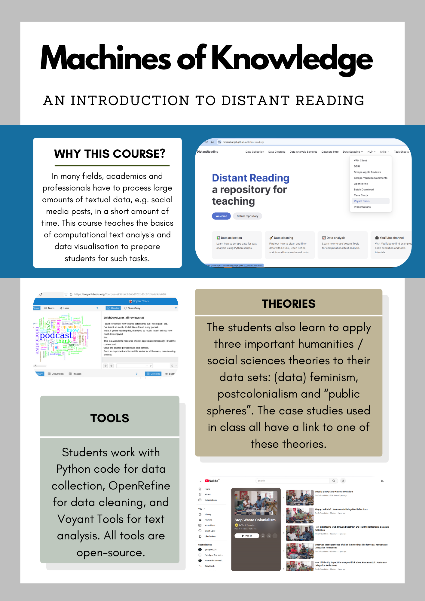

# DistantReading

## Genesis and purpose of the repository

I ([@MonikaBarget](https://github.com/MonikaBarget/atr-historical-research/commits?author=MonikaBarget)) started this repository in 2022 to give students taking courses in computational text analysis at Maastricht University better access to code, data samples and short instructions. In the Faculty of Arts and Social Sciences, most students have limited experience with digital technologies when starting their studies, so my teaching materials are designed for beginners. While my own MA Digital Cultures students, who take the course "Machines of Knowledge" (see Figure 1 for course overview), were my initial audience, students at other institutions as well as researchers without previous programming experience may also find this repository helpful to explore the possibilities of *distant reading* for their work. 

 

**Figure 1:** Overview of the “Machines of Knowledge” course framework.

The term "distant reading" (Franco Moretti) is often used to describe computator-assisted and often statistical text analysis as opposed to human-performed *close reading*. A basis of distant reading is machine-readable text, which is why this repository also provides materials on (automated) data collection for academic purposes. The focus is on natively digital text in the form of social media posts, comments and reviews, but distant reading can also be applied to retro-digitised materials. 
Respecting Maastricht University's committment to Open Science, I also highlight the use of open-source software where possible. My Python code for data cleaning and data collection was written specifically for the Data Science Research Infrastructure (DSRI) at Maastricht University and may require changes when run in other environments. Students and researchers from other universities should consult their local ICT services.

## Credits and updates

I have developed the resources shared here in close collaboration with my students and several colleagues / co-teachers. Thanks to generous financial and logistical support by the digital studies lab [The Plant](https://theplant.maastrichtuniversity.nl/) at the Faculty of Arts and Social Sciences, I was able to create the rudimentary website in 2024. Arnoud Wils (The Plant, FASoS) has kindly reviewed my code and provided instructions for using infrastructures specific to Maastricht University. Susan Schreibman (Professor of Digital Arts and Culture, FASoS) and some of my MA students have inspired case studies and are credited in the relevant sections. More case studies and tutorials will be added over time, and some sections are clearly work in progress. In 2025, further funding by the Maastricht University Library (UB) allowed me to hire student assistants Caroline Deharbe and Johanna Pichl to add academic resources and produce additional video tutorials. Please also be aware that code can quickly deprecate. If you have any questions or would like to flag missing / outdated information, please use the issue section in the code repository to inform me.

## Contact and contributing

If you have questions or would like to collaborate, please reach out! You can connect with me in the Faculty of Arts and Social Sciences (FASoS) at Maastricht University or [find me on Mastodon](https://akademienl.social/@mob).

### Cited Works and Further Readings

- Aurnhammer, C., Cuppen, I., van de Ven, I., & van Zaanen, M. (2019). Manual Annotation of Unsupervised Models: Close and Distant Reading of Politics on Reddit. *DHQ: Digital Humanities Quarterly, 13*(3).
- Bludau, M.-J., Brüggemann, V., Busch, A., & Dörk, M. (2020). Reading traces: Scalable exploration in elastic visualizations of cultural heritage data. *Computer Graphics Forum, 39*(3), 77–87. https://doi.org/10.1111/cgf.13964
- Caulfield, J. (2019, November 8). *Textual Analysis | Guide, 3 approaches & examples.* Scribbr. https://www.scribbr.com/methodology/textual-analysis/
- Clavert, F., & Fickers, A. (2018). On pyramids, prisms, and scalable reading. *Journal of Digital History, 1*(1). https://journalofdigitalhistory.org/en/article/jXupS3QAeNgb
- COST Association. (2022, September 12). *Changing the way European literary history is written with distant-reading.* COST. https://www.cost.eu/distant-reading/
- Drakman, A., & Gelfgren, S. (2023). How to combine close and distant reading within the history of science and ideas: Two examples from ongoing research. *Lychnos, 2022,* 85–108. https://doi.org/10.48202/24128
- Fleming, P. (2017). Tragedy, for example: distant reading and exemplary reading (Moretti). *New Literary History, 48*(3), 437–455. https://doi.org/10.1353/nlh.2017.0021
- Gabi, K. (2022). Computation as Context: New Approaches to the Close/Distant Reading Debate. *College Literature, 49*(1), 1–25. https://doi.org/10.1353/lit.2022.0000
- Jänicke, S., Franzini, G., Cheema, M. F., & Scheuermann, G. (2015). On close and distant reading in digital humanities: A survey and future challenges. *Eurographics,* 83–103. https://doi.org/10.2312/eurovisstar.20151113
- Roskos, K., & Neuman, S. B. (2014). Best practices in reading: A 21st century skill update. *The Reading Teacher, 67*(7), 507–511. http://www.jstor.org/stable/24573611
- Taylor, J. E., Gregory, I. N., & Donaldson, C. (2018). Combining close and distant reading: A multiscalar analysis of the English Lake District’s historical soundscape. *International Journal of Humanities and Arts Computing, 12*(2), 163–182. https://doi.org/10.3366/ijhac.2018.0220
- Weitin, T. (2017). Scalable reading. *Zeitschrift für Literaturwissenschaft und Linguistik, 47*(1), 1–6. https://doi.org/10.1007/s41244-017-0048-4

